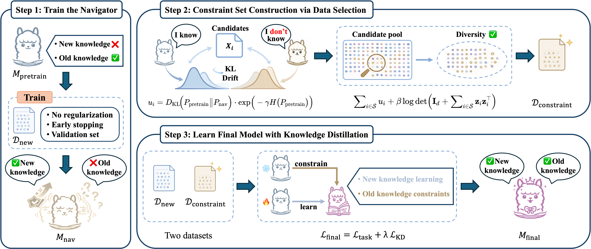

# NADS

## 🎉 News

We are thrilled to announce that our paper has been accepted to the **NeurIPS Main track 2026**! Congratulations to the entire team! 🥳

📄 **Paper:** [come soon](#)


Navigator-Guided Data Selection (**NADS**) is a fine-tuning pipeline for reducing catastrophic forgetting while adapting a language model to a new task. The method first trains a "navigator" on the new-task data, then uses the drift between the pretrained model and the navigator to select a diverse constraint set from a candidate pool. The final model is trained on the new task while distilling the pretrained model on the selected constraint set.



## Contributions

- We propose NADS, a novel fine-tuning framework for LLMs that uses recipe-conditioned navigator drift to guide data selection for forgetting mitigation. NADS trains a navigator under the target recipe without preservation regularization to deliberately expose drift in pretrained capabilities and then uses this drift to estimate the forgetting-aware utility of candidate samples.

- We formulate constraint set construction as a utility-diversity selection problem, and propose an efficient optimization strategy that renders this otherwise costly DPP-based formulation practical at scale. The resulting method reduces utility-diversity selection cost while preserving sample quality and diversity. We further provide theoretical analysis that motivates the proposed framework.

- We conduct extensive experiments across two benchmarks and three model families spanning 3B-9B parameters. Results show that NADS delivers a stronger balance between new-task adaptation and general capability preservation, while achieving this with lower utility-diversity selection cost.

## Method Overview

NADS follows three stages:

1. **Train the navigator**

   A navigator model `M_nav` is fine-tuned on the new-task dataset `D_new`. This model captures the new knowledge that the original pretrained model does not yet know.

2. **Construct the constraint set**

   For each sample in the candidate pool, NADS compares the pretrained model distribution and the navigator distribution:

   ```text
   u_i = D_KL(P_pretrain || P_nav) * exp(-gamma * H(P_pretrain))
   ```

   The code also extracts mean-pooled hidden-state embeddings, applies random projection and whitening, and optimizes a diversity-aware objective:

   ```text
   sum_i w_i u_i + beta * log det(I + sum_i w_i z_i z_i^T) - (nu / 2) * ||w||_2^2
   ```

   Iterative hard thresholding (IHT) selects the top `k` samples as `D_constraint`.

3. **Train the final model**

   The final student model is trained on `D_new` and constrained with knowledge distillation from the pretrained teacher on `D_constraint`:

   ```text
   L_final = L_task + lambda * L_KD
   ```

## Repository Layout

```text
NADS-main/
  train_arithmetic.py        # Stage 1 navigator training and Stage 3 final training
  select_data.py             # Stage 2 NADS data selection
  nads/
    data.py                  # Dataset loading, prompt building, tokenization, collators
    selection.py             # Utility scoring, embedding projection, IHT selection
    training.py              # Native SFT and distillation training loops
  scrpit/
    Magicoder/               # Example scripts for code-task experiments
    MetaMathQA/              # Example scripts for math-task experiments
```

The directory name `scrpit` is kept as it appears in the project.

## Installation

Create a Python environment with PyTorch installed for your CUDA version, then install the main dependencies:

```bash
pip install torch transformers datasets peft accelerate tqdm numpy
pip install lm-eval
```

Optional dependencies:

```bash
pip install flash-attn
pip install llamafactory
```

`flash-attn` is optional because the scripts can fall back to `sdpa` or `eager` attention. `llamafactory` is only needed when using `--stage1_backend llamafactory`.

## Data Format

Datasets should provide instruction and response fields. The default field names are:

```json
{"instruction": "Write a Python function...", "response": "def ..."}
```

For MetaMathQA-style data, the scripts use:

```json
{"query": "What is ...?", "response": "The answer is ..."}
```

Supported dataset inputs include:

- Hugging Face dataset names
- local datasets saved with `datasets.save_to_disk`
- directories containing `.parquet`, `.json`, `.jsonl`, or `.csv` files
- individual `.json`, `.jsonl`, or `.parquet` files

Dataset paths can also include slices such as `dataset_name[0:1000]`.

## Quick Start

The example scripts assume they are launched from the workspace root that contains `NADS-main`, `models`, `datasets`, and `nads_results`. If you run commands from inside `NADS-main`, remove the `NADS-main/` prefix from Python entry points.

### Stage 1: Train a Navigator

```bash
torchrun --nproc_per_node=2 NADS-main/train_arithmetic.py \
  --skip_stage3 \
  --model_name_or_path ./models/llama-3_2-3b \
  --new_data_path ./datasets/MetaMathQA \
  --new_dataset_split train \
  --new_instruction_field query \
  --new_response_field response \
  --output_dir ./nads_results/metamathqa_navigator \
  --stage1_backend native \
  --stage1_finetune_type full \
  --stage1_batch_size 1 \
  --stage1_epochs 3 \
  --stage1_lr 1e-4 \
  --max_seq_length 1024 \
  --device cuda
```

The navigator checkpoint is saved to:

```text
<output_dir>/stage1_navigator
```

### Stage 2: Select a Constraint Set

```bash
torchrun --nproc_per_node=2 NADS-main/select_data.py \
  --model_name_or_path ./models/llama-3_2-3b \
  --navigator_ckpt ./nads_results/metamathqa_navigator/stage1_navigator \
  --candidate_data_path ./datasets/Magpie-Qwen2.5-Pro-300K-Filtered \
  --candidate_dataset_split train \
  --candidate_instruction_field instruction \
  --candidate_response_field response \
  --output_dir ./nads_results/metamathqa_selection \
  --stage2_batch_size 2 \
  --max_seq_length 1024 \
  --nads_select_k 15000 \
  --nads_proj_dim 256 \
  --attn_implementation sdpa \
  --dtype bfloat16
```

Main outputs:

```text
selected_indices.json        # indices for D_constraint
utilities.npy                # per-sample utility scores
projected_embeddings.npy     # projected and whitened embeddings
weights.npy                  # IHT weights
last_hidden_embeddings.npy   # raw mean-pooled hidden embeddings
selection_summary.json       # selection configuration and metadata
```

### Stage 3: Train the Final Model

```bash
torchrun --nproc_per_node=2 NADS-main/train_arithmetic.py \
  --skip_stage1 \
  --stage3_backend native \
  --model_name_or_path ./models/llama-3_2-3b \
  --new_data_path ./datasets/MetaMathQA \
  --new_dataset_split train \
  --new_instruction_field query \
  --new_response_field response \
  --candidate_data_path ./datasets/Magpie-Qwen2.5-Pro-300K-Filtered \
  --candidate_dataset_split train \
  --candidate_instruction_field instruction \
  --candidate_response_field response \
  --selected_indices_path ./nads_results/metamathqa_selection/selected_indices.json \
  --output_dir ./nads_results/metamathqa_final \
  --stage3_finetune_type full \
  --stage3_task_batch_size 1 \
  --stage3_kd_batch_size 1 \
  --stage3_epochs 3 \
  --stage3_lr 1e-4 \
  --stage3_grad_accum_steps 1 \
  --distill_lambda 5 \
  --max_seq_length 1024 \
  --device cuda
```

The final model is saved to:

```text
<output_dir>/stage3_final
```

## Example Scripts

The project includes task-specific shell scripts:

```text
scrpit/Magicoder/select.sh
scrpit/Magicoder/training.sh
scrpit/Magicoder/full_eval.sh
scrpit/MetaMathQA/select.sh
scrpit/MetaMathQA/training.sh
scrpit/MetaMathQA/full_eval.sh
```

Before running them, update GPU IDs, model paths, dataset paths, and selected index paths for your machine.

For training:

```bash
sh NADS-main/scrpit/MetaMathQA/training.sh
sh NADS-main/scrpit/Magicoder/training.sh
```

For evaluation, fill `MODELS_CONFIG` in the corresponding `full_eval.sh`:

```bash
MODELS_CONFIG=(
  "run_name|/path/to/base_model|/path/to/final_or_adapter_checkpoint"
)
```

Then run:

```bash
bash NADS-main/scrpit/MetaMathQA/full_eval.sh
bash NADS-main/scrpit/Magicoder/full_eval.sh
```

The evaluation scripts use `lm_eval` on:

- HumanEval
- GSM8K
- MMLU
- HellaSwag
- OpenBookQA

For HumanEval, the scripts set:

```bash
export HF_ALLOW_CODE_EVAL="1"
```

Only run code-generation evaluation in an environment where unsafe code execution is acceptable.

## Important Arguments

### Training

- `--skip_stage1`: skip navigator training and run Stage 3 only.
- `--skip_stage3`: train only the navigator.
- `--stage1_finetune_type`: `full` or `lora`.
- `--stage3_finetune_type`: `full` or `lora`.
- `--selected_indices_path`: path to `selected_indices.json` from Stage 2.
- `--distill_lambda`: weight for the KD constraint loss.
- `--val_ratio`: validation split ratio from the new-task data.
- `--attn_implementation`: `auto`, `flash_attention_2`, `sdpa`, or `eager`.

### Selection

- `--navigator_ckpt`: navigator checkpoint from Stage 1.
- `--candidate_data_path`: candidate pool used to build `D_constraint`.
- `--nads_select_k`: number of samples to select.
- `--nads_gamma`: entropy penalty strength in the utility score.
- `--nads_beta`: diversity weight in the selection objective.
- `--nads_nu`: L2 regularization weight for IHT selection.
- `--nads_proj_dim`: projected embedding dimension.
- `--nads_iht_eta`: IHT step size.
- `--nads_iht_steps`: number of IHT optimization steps.
- `--kl_vocab_chunk_size`: enable chunked KL computation to reduce peak memory.

## Notes

- The native training backend supports distributed training through `torchrun`.
- Stage 3 intentionally uses the custom native backend because it combines task SFT with KD on the selected constraint set.
- LoRA mode requires `peft`. Use `--lora_merge_before_save` if you want to save merged full-model weights instead of adapters.
- `prompt_style=auto` switches to a code-oriented prompt when the instruction appears to be a programming task.
- Evaluation scripts copy tokenizer files from the base model into the evaluated checkpoint directory before running `lm_eval`.
